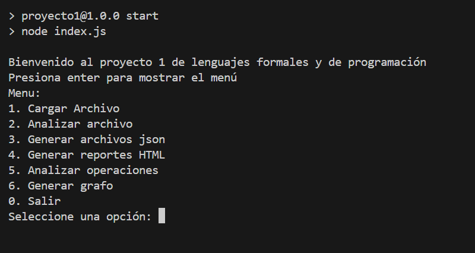

# UNIVERSIDAD DE SAN CARLOS DE GUATEMALA  
## FACULTAD DE INGENIERÍA  
### LENGUAJES FORMALES Y DE PROGRAMACIÓN  

**CATEDRÁTICO**: INGA. ASUNCIÓN MARIANA SIC SOR  
**TUTOR ACADÉMICO**: ELDER ANIBAL PUM ROJAS  

---

### ELEAZAR NEFTALÍ COLOP COLOP  
**CARNÉ**: 3198935960914  
**SECCIÓN**: A  

**GUATEMALA, 19 DE DICIEMBRE DEL 2024**

---

## ÍNDICE  

1. **OBJETIVOS DEL SISTEMA**  
   - General  
   - Específicos  
2. **INTRODUCCIÓN**  
3. **INFORMACIÓN DEL SISTEMA**  
4. **REQUISITOS DEL SISTEMA**  
5. **FLUJO DE LAS FUNCIONALIDADES DEL SISTEMA**  

---

## OBJETIVOS DEL SISTEMA  

### General  
Proporcionar una guía detallada y accesible para que cualquier usuario pueda utilizar el programa desarrollado de manera eficiente, explorando sus funcionalidades y comprendiendo el flujo del sistema.  

### Específicos  
- **Objetivo 1**: Explicar las funcionalidades principales del programa, asegurando que el usuario comprenda cómo interactuar con él desde el inicio hasta el final.  
- **Objetivo 2**: Guiar al usuario en la ejecución de cada opción del menú, detallando qué esperar y cómo utilizar cada una de las herramientas disponibles.  

---

## INTRODUCCIÓN  

### Propósito del manual  
Este manual tiene como objetivo facilitar a los usuarios el entendimiento y manejo del programa. Con una guía paso a paso, cualquier persona, incluso sin conocimientos avanzados en tecnología, podrá aprovechar al máximo las funcionalidades de la aplicación.  

### Breve descripción del sistema  
La aplicación desarrollada permite realizar tareas relacionadas con la gestión y análisis de archivos, generación de reportes y visualización de datos a través de grafos. El sistema opera mediante un menú interactivo en la terminal, ofreciendo opciones como cargar archivos, analizar su contenido, generar reportes en distintos formatos y procesar operaciones para generar grafos representativos.  

---

## INFORMACIÓN DEL SISTEMA  

El programa está diseñado para funcionar mediante una interfaz de línea de comandos, guiando al usuario con un menú estructurado. A continuación, se describe el flujo general de trabajo:  
1. **Inicio del programa**: El usuario es recibido con un mensaje de bienvenida y se le solicita presionar una tecla para acceder al menú principal.  
2. **Opciones del menú**:  
   - Cargar un archivo desde una ruta especificada.  
   - Analizar el archivo cargado para identificar tokens y errores léxicos.  
   - Generar reportes en formatos JSON y HTML.  
   - Analizar operaciones dentro del archivo cargado.  
   - Generar un grafo basado en los datos procesados.  
3. **Salida**: El usuario puede elegir salir del programa en cualquier momento desde el menú principal.  

---

## REQUISITOS DEL SISTEMA  

### Hardware  
- **Procesador**: Intel Core i3 o superior.  
- **Memoria RAM**: Mínimo 4 GB.  
- **Almacenamiento**: Al menos 100 MB libres.  

### Software  
- **Sistema operativo**: Windows 10, macOS 10.14 o distribuciones Linux modernas.  
- **Node.js instalado**: Versión 14 o superior.  

---

## FLUJO DE LAS FUNCIONALIDADES DEL SISTEMA  

### Inicio del programa  
- **Ejecutar la aplicación**:  
  - Abra la terminal.  
  - Navegue al directorio del programa.  
  - Escriba `node app.js` o `npm start` desde Visual Studio Code y presione Enter.  
- **Bienvenida**: Se mostrará un mensaje de bienvenida. Presione Enter para acceder al menú principal.  

### Opciones del menú principal  
1. **Cargar archivo**  
   - Seleccione la opción 1.  
   - Escriba la ruta completa del archivo que desea cargar.  
   - Si el archivo se carga con éxito, se mostrará su contenido en la terminal.  

2. **Analizar archivo**  
   - Seleccione la opción 2.  
   - El sistema analizará el archivo, mostrando los tokens identificados y los errores encontrados.  

3. **Generar archivos JSON**  
   - Seleccione la opción 3.  
   - Aparecerá un submenú con opciones para generar archivos JSON de errores o tokens.  
   - El archivo se guardará en el directorio de trabajo.  

4. **Generar reportes HTML**  
   - Seleccione la opción 4.  
   - Aparecerá un submenú con opciones para generar reportes HTML de errores o tokens.  
   - El archivo se abrirá en su navegador predeterminado.  

5. **Analizar operaciones**  
   - Seleccione la opción 5.  
   - El sistema analizará operaciones matemáticas dentro del archivo cargado y mostrará los resultados en la terminal.  

6. **Generar grafo**  
   - Seleccione la opción 6.  
   - El sistema generará un grafo basado en los datos del archivo y guardará una imagen del grafo en el directorio.  

### Salida del programa  
- Seleccione la opción 0 para salir del programa. Se mostrará un mensaje de despedida antes de cerrar la aplicación.  

